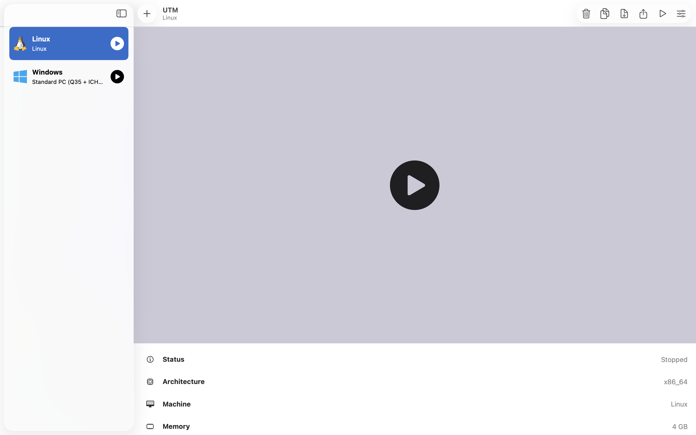

# Ubuntu Linux Notes

## About

I replaced Windows on my Lenovo laptop with Ubuntu Linux to get more hands-on experience with Linux, using the terminal, and learning how Linux systems work.

I later used Ubuntu as the host OS for my security homelab, running virtual machines through VirtualBox.

After moving to a MacBook Pro with Apple Silicon, I switched from VirtualBox to UTM.




This repo is just a collection of notes, commands, screenshots, and things I learn while using Linux. It's mainly a place for me to document what I'm learning and track my progress over time.

---

## Experience So Far

- Installing and configuring Ubuntu Linux
- Using Linux as a daily operating system
- Navigating the filesystem from the terminal
- Using common Linux commands for day-to-day tasks
- Managing files and directories
- Installing and updating packages with APT
- Running system updates and basic maintenance
- Using `sudo` and understanding basic permissions
- Troubleshooting issues using documentation, forums, and logs
- Running virtual machines for homelab projects

---

## Commands I Use Often

```bash
pwd
ls
cd
mkdir
touch
cp
mv
rm

sudo apt update && sudo apt upgrade -y
sudo apt autoremove
```

---

## Current Goal

Keep using Linux daily, get more comfortable working from the terminal, and continue building my Linux and system administration skills as I learn.
